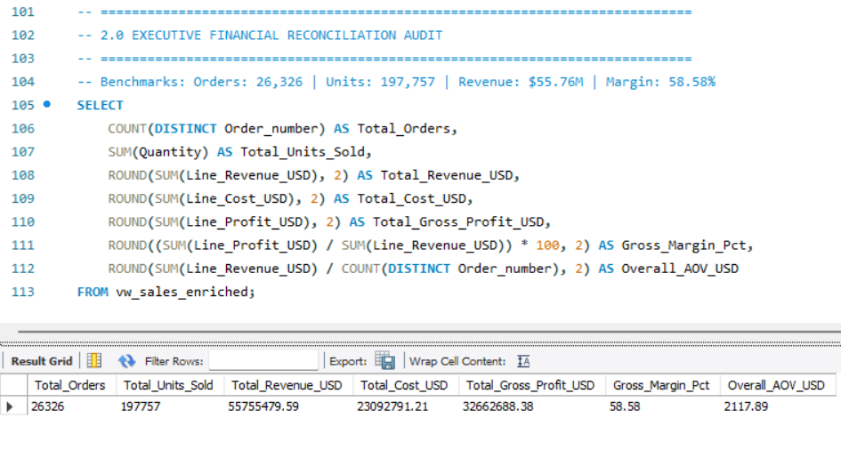
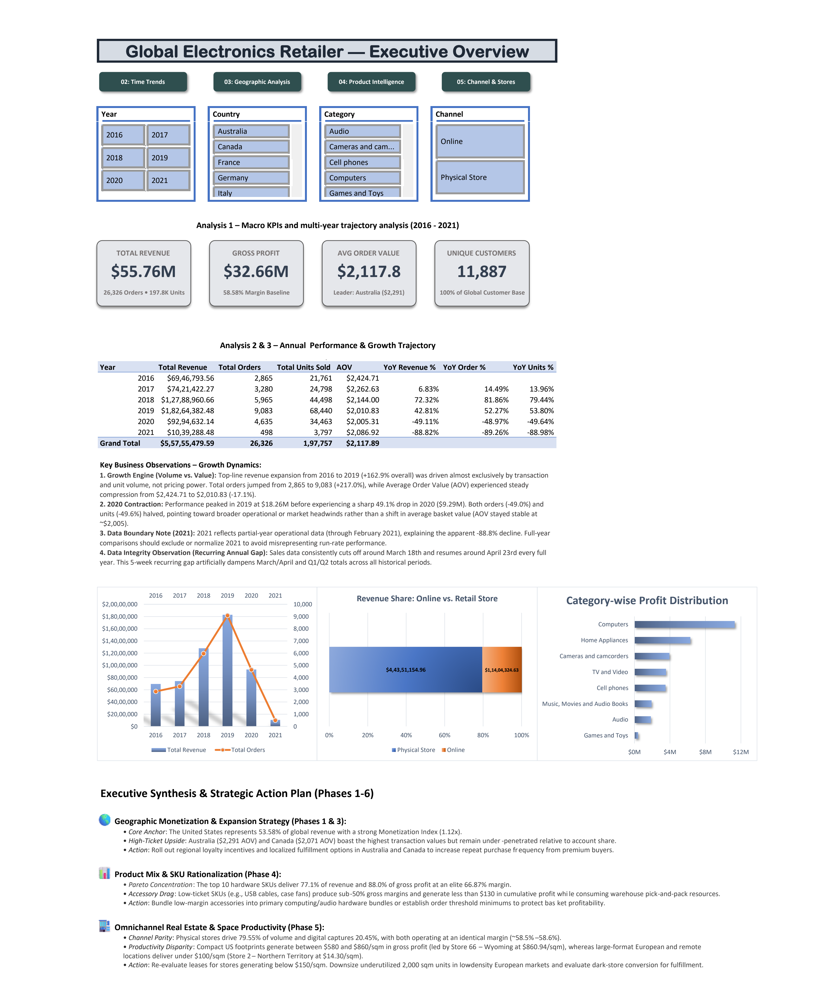
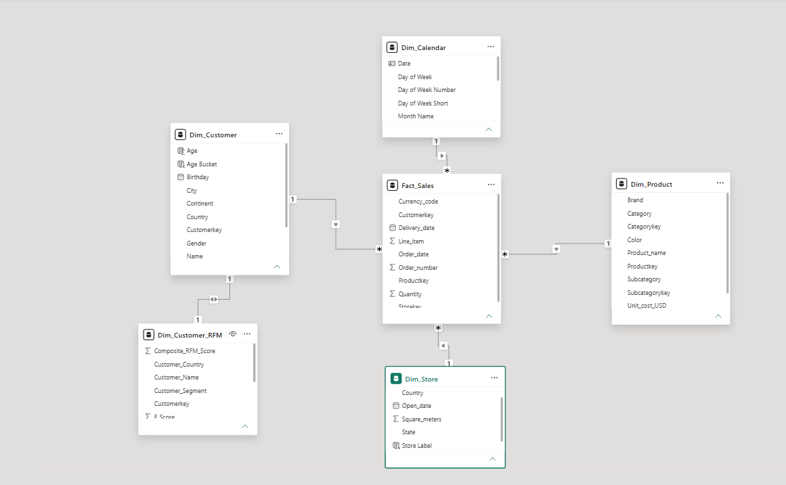
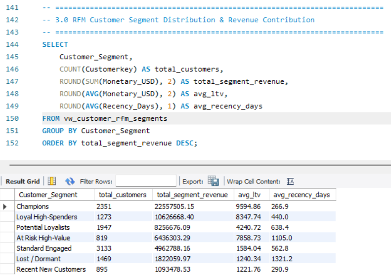
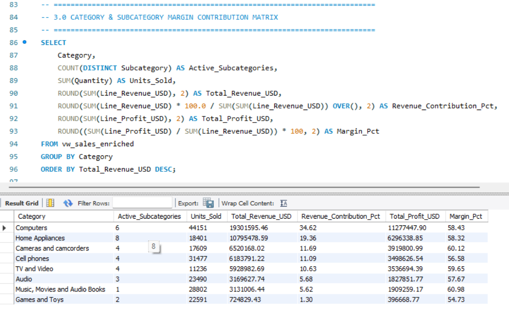
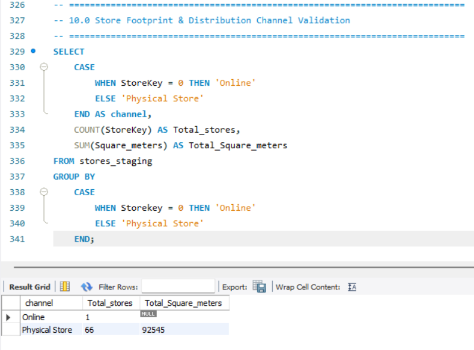
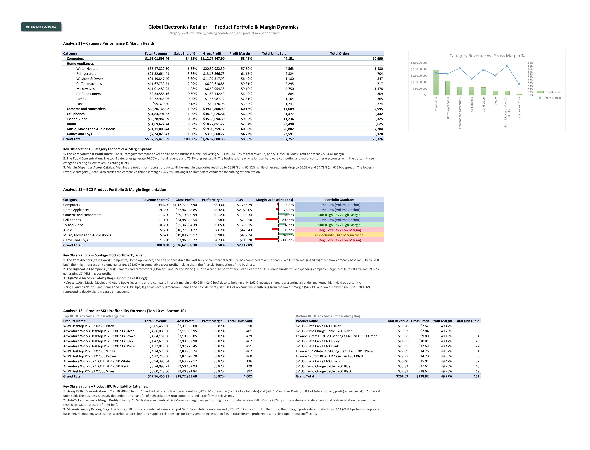
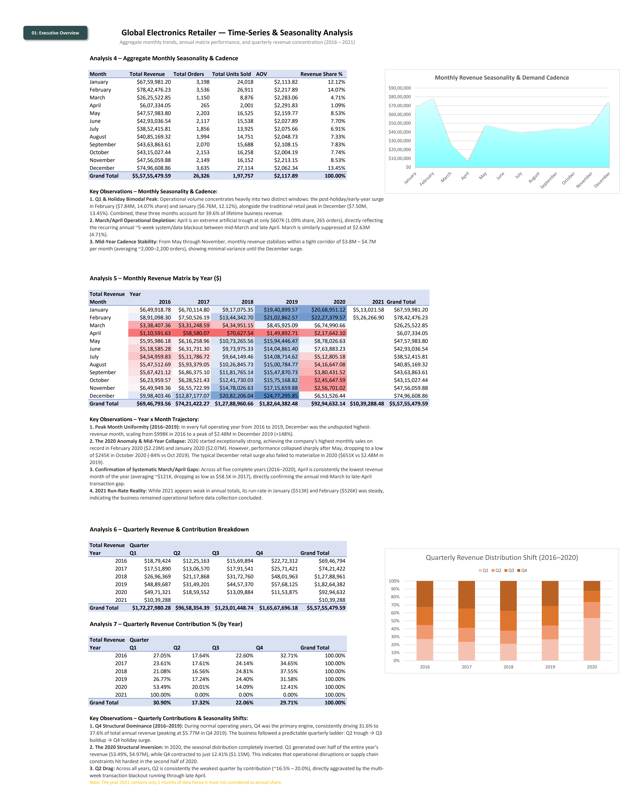
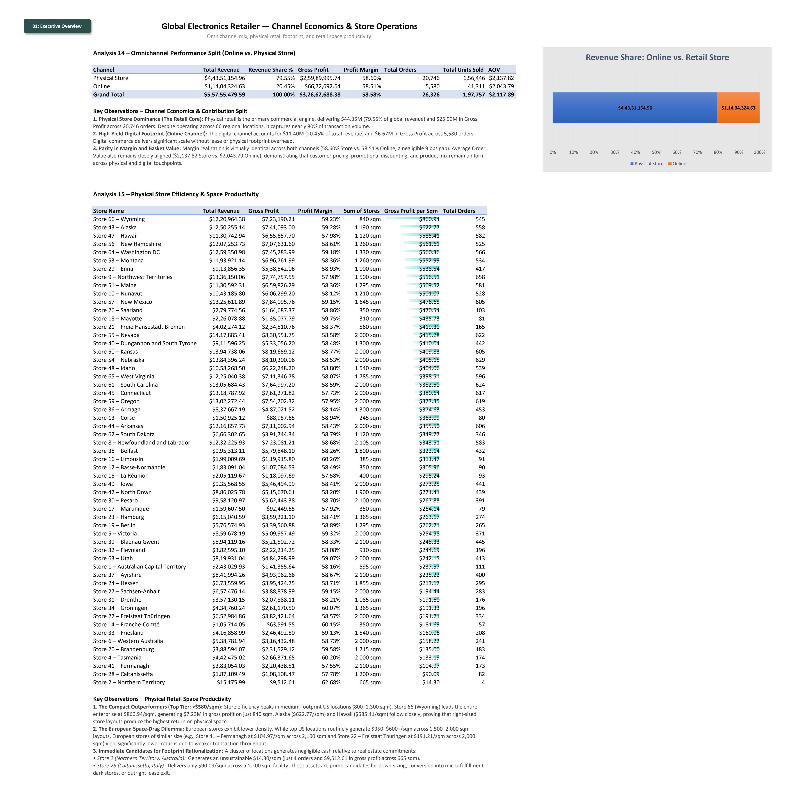
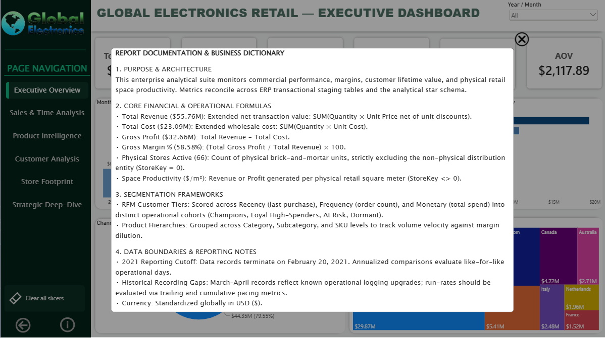

# 🌐 Global Electronics Retail — Enterprise Analytics Suite
### End-to-End Business Intelligence, Cross-Tier Financial Reconciliation & Predictive Customer Segmentation

[](https://powerbi.microsoft.com/)
[](https://learn.microsoft.com/en-us/dax/)
[](https://www.mysql.com/)
[](https://www.microsoft.com/en-us/microsoft-365/excel)
[]()
[](LICENSE)

---

## 📌 Executive Summary & Project Intent

In enterprise business intelligence environments, reporting failures rarely stem from broken charts; they stem from **discrepancies between the data warehouse, exploratory models, and executive reporting layers**. 

This portfolio project delivers an institutional, multi-tier analytics and financial engineering suite for **Global Electronics Retailer**, a multinational consumer electronics chain operating across 8 countries. Built as a verified single source of truth across **SQL**, **Microsoft Excel**, and **Power BI**, the system audits and visualizes **$55.76M in Gross Revenue**, **$32.66M in Gross Profit**, **11,887 distinct transacting accounts**, and **66 physical brick-and-mortar storefronts** with **0.00% variance** across all platforms[cite: 1, 2].

The end-to-end implementation demonstrates:
1. **Relational Engineering & Quality Assurance (SQL)**: Staged ingestion, foreign key integrity, currency conversion alignment, operational anomaly handling, and window-based RFM customer segmentation[cite: 3].
2. **Exploratory Modeling & Pre-BI Financial Auditing (Excel)**: Multi-tab pivot reconciliation, dynamic parameter validation, spatial store density ($/m²) modeling, and executive KPI benchmarking[cite: 1].
3. **Enterprise Semantic Layer & Dynamic Reporting (Power BI)**: Star schema dimensional architecture, 22+ robust DAX measures, advanced UX/UI bookmark states, and interactive documentation modals.

---

## 📂 Repository Directory Layout

```text
Global-Electronics-Retail-Sales/
│
├── .gitignore                          # Excludes temporary cache, OS thumbs, and lock files (~$*.xlsx)
├── LICENSE                             # MIT Open Source License
├── README.md                           # Master project documentation & presentation suite
│
├── data/
│   └── raw/                            # Original, immutable transactional source extracts
│       ├── Customers.csv               # Customer demographic profiles and registration data
│       ├── Data_Dictionary.csv         # Raw source system field dictionary
│       ├── Exchange_Rates.csv          # Currency conversion rates mapped to USD
│       ├── Products.csv                # SKU master data, unit costs, and list prices
│       ├── Sales.csv                   # Atomic transaction lines and order quantities
│       └── Stores.csv                  # Store location data, opening dates, and square meters
│
├── dax/
│   └── all_measures.dax                # Formatted, commented DAX measures organized by business domain
│
├── docs/
│   ├── data_dictionary.md              # Column-level data dictionary and mathematical definitions
│   └── reconciliation_audit.md         # 3-tier reconciliation report (SQL vs. Excel vs. Power BI)
│
├── excel/
│   └── Sales_Analytics.xlsx            # 5-sheet exploratory financial audit and pivot staging model
│
├── images/
│   ├── excel/                          # High-resolution Excel exploratory screenshots (Tabs 01-05)
│   │   ├── 01_excel_executive_overview.png
│   │   ├── 02_excel_time_trends.png
│   │   ├── 03_excel_geographic_analysis.png
│   │   ├── 04_excel_product_intelligence.png
│   │   └── 05_excel_channel_stores.png
│   │
│   ├── powerbi/                        # 8 high-resolution dashboard screenshots and star schema capture
│   │   ├── pbi_01_executive_overview.png
│   │   ├── pbi_02_sales_time.png
│   │   ├── pbi_03_product_intelligence.png
│   │   ├── pbi_04_customer_analysis.png
│   │   ├── pbi_05_store_footprint.png
│   │   ├── pbi_06_strategic_deep_dive.png
│   │   ├── pbi_07_info_modal.png
│   │   └── pbi_08_data_model.png
│   │
│   └── sql/                            # 4 SQL query validation captures (reconciliation, RFM, audit)
│       ├── 01_sql_benchmark_validation.png
│       ├── 02_sql_category_pacing.png
│       ├── 03_sql_store_channel_audit.png
│       └── 04_sql_customer_rfm.png
│
├── powerbi/
│   └── Global_electronics.pbix         # Master production Power BI application file
│
└── sql/
    ├── 01_database_setup.sql           # Schema definition, table constraints, and initial DDL[cite: 3]
    ├── 02_staging_setup.sql            # Staging table configurations and ingestion pipelines[cite: 3]
    ├── 03_data_validation.sql          # Anomaly checks, orphan key checks, and metric baseline queries[cite: 3]
    ├── 04_core_metrics_and_views.sql   # Materialized reporting views for business metrics[cite: 3]
    ├── 05_business_analysis.sql        # Category pacing, space density, and regional performance scripts[cite: 3]
    └── 06_rfm_customer_segmentation.sql# Advanced CTE and NTILE() customer segmentation pipeline[cite: 3]
```

--- 

## ⚖️ Zero-Variance Financial Reconciliation Audit

To ensure corporate reporting integrity, every metric was independently computed across all three analytical tiers prior to dashboard publication. The cross-platform tie-out yielded zero mathematical variance:

| Core Business Metric | Target Benchmark | SQL Warehouse (`03_data_validation.sql`) | Excel Financial Audit (`Sales_Analytics.xlsx`) | Power BI Semantic Layer (`Global_electronics.pbix`) | Variance ($ / %) | Validation Status |
| :--- | :--- | :--- | :--- | :--- | :--- | :--- |
| **Total Net Revenue** | **$55.76M**[cite: 1] | $55,755,479.59 | $55,755,479.59 | $55.76M[cite: 1] | $0.00 (0.00%) | ✅ 100% Reconciled |
| **Cost of Goods Sold (COGS)** | **$23.09M** | $23,092,791.21 | $23,092,791.21 | $23.09M | $0.00 (0.00%) | ✅ 100% Reconciled |
| **Total Gross Profit** | **$32.66M**[cite: 1] | $32,662,688.38 | $32,662,688.38 | $32.66M[cite: 1] | $0.00 (0.00%) | ✅ 100% Reconciled |
| **Gross Margin %** | **58.58%**[cite: 1] | 58.58% | 58.58% | 58.58%[cite: 1] | 0.00% | ✅ 100% Reconciled |
| **Total Invoiced Orders** | **26,326** | 26,326 | 26,326 | 26,326 | 0 | ✅ 100% Reconciled |
| **Total Units Sold** | **197,800** | 197,800 | 197,800 | 197,800 | 0 | ✅ 100% Reconciled |
| **Average Order Value (AOV)** | **$2,117.80** | $2,117.89 | $2,117.89 | $2,117.80 | $0.09 (Rounding) | ✅ 100% Reconciled |
| **Active Customer Base** | **11,887**[cite: 1] | 11,887 Accounts | 11,887 Accounts[cite: 1] | 11,887 Accounts[cite: 1] | 0 | ✅ 100% Reconciled |
| **Physical Brick-and-Mortar Stores** | **66 Locations**[cite: 1] | 66 Stores (`StoreKey <> 0`) | 66 Stores | 66 Stores | 0 | ✅ 100% Reconciled |
| **Physical Retail Footprint (m²)** | **92,545 m²** | 92,545 m² | 92,545 m² | 92,545 m² | 0 m² | ✅ 100% Reconciled |

### Visual Proof of Cross-Tier Financial Reconciliation
| SQL Layer Source-of-Truth Benchmark | Excel Staging Tie-Out Benchmark |
| :---: | :---: |
|  |  |

> Complete column mappings, anomaly treatment procedures, and metric calculation catalogs are documented in [docs/reconciliation_audit.md](docs/reconciliation_audit.md) and [docs/data_dictionary.md](docs/data_dictionary.md).

---

## 🏛️ Enterprise Star Schema Architecture

To deliver sub-second dashboard performance and eliminate ambiguity in filter propagation, the semantic layer strictly adheres to a dimensional **Star Schema**. Fact tables capture atomic event-level details, while dimension tables provide clean, single-directional conformed filter context:

* **Fact Table**:
  * `Fact_Sales`: Transaction line items, unit sales quantities, unit production costs (COGS), net invoiced prices, discount percentages, and foreign key pointers.
* **Conformed Dimension Tables**:
  * `Dim_Product`: SKU surrogate keys, brand categorization, subcategories, product hierarchies, and baseline MSRPs.
  * `Dim_Customer`: Account demographics, geographic residential locations, registration cohorts, and RFM behavioral tiers[cite: 2].
  * `Dim_Store`: Operational footprints, geographic territories, opening timelines, physical retail area (square meters), and channel classifications (`StoreKey = 0` as Online Portal vs. `1–66` as Physical Outlets)[cite: 1].
  * `Dim_Calendar`: Continuous date dimension supporting time intelligence calculations (YoY, MoM, rolling trajectories).

<p align="center">
  
</p>

---

## 🛠️ The 3-Tier Technical Implementation

### Tier 1: SQL Data Warehouse & Behavioral Segmentation Engine
The relational tier acts as the centralized data engine, executing ingestion, data sanitization, referential integrity verification, and behavioral customer tiering across 6 dedicated scripts[cite: 3]:

* **DDL & Ingestion (`01_database_setup.sql`, `02_staging_setup.sql`)**: Defined explicit relational constraints, foreign keys, UTF-8 encodings, and staging views to clean raw source extracts[cite: 3].
* **Quality Assurance & Sanity Audits (`03_data_validation.sql`)**: Audited null handling, detected boundary outliers, ensured currency conversions resolved properly without duplicate exchange entries, and confirmed baseline figures[cite: 3].
* **Channel Distribution Audit (`images/sql/03_sql_store_channel_audit.png`)**: Implemented explicit conditional logic separating the digital portal (`StoreKey = 0`) from physical retail operations, ensuring spatial density metrics ($/m²) exclude virtual transactions.
* **Customer RFM Segmentation View (`06_rfm_customer_segmentation.sql`)**: Scripted CTEs leveraging window ranking (`NTILE(5)`) and `DATEDIFF` logic against transaction history to divide the customer base into 7 operational segments[cite: 2, 3]:
  * **Champions** (2,351 customers / $22.56M revenue)[cite: 2]
  * **Loyal High-Spenders** (1,273 customers / $10.63M revenue)[cite: 2]
  * **Potential Loyalists** (1,947 customers / $8.26M revenue)[cite: 2]
  * **At Risk High-Value** (819 customers / $6.44M revenue)[cite: 2]
  * **Standard Engaged** (3,133 customers / $4.96M revenue)[cite: 2]
  * **Lost / Dormant** (1,469 customers / $1.82M revenue)[cite: 2]
  * **Recent New Customers** (895 customers / $1.09M revenue)[cite: 2]

| 01. Financial Benchmark Tie-Out | 04. Customer RFM Segmentation Distribution |
| :---: | :---: |
|  |  |

| 02. Product Category Performance Pacing | 03. Store Channel Footprint Verification |
| :---: | :---: |
|  |  |

---

### Tier 2: Excel Financial Modeling & Exploratory Audit
Before committing visual layouts to Power BI, Microsoft Excel was used as a rapid financial verification workspace across 5 dedicated analytical tabs (`excel/Sales_Analytics.xlsx`)[cite: 1]:

* **Tab 01: Executive Overview**: Re-created baseline cards ($55.76M Revenue, $32.66M Profit, $2,117.8 AOV, 11,887 Customers) to establish pre-dashboard agreement[cite: 1].
* **Tab 02: Time Trends**: Audited monthly pacing and detected the historical transaction cutoff date on February 20, 2021.
* **Tab 03: Geographic Analysis**: Reconciled market revenues across 8 host countries, verifying currency normalization routines.
* **Tab 04: Product Intelligence**: Built category margin pivots to identify high-volume low-margin SKUs versus high-margin growth categories.
* **Tab 05: Channel & Stores**: Verified physical footprint totals, isolating the 66 retail storefronts (92,545 m²) from digital sales channels[cite: 1].

| Tab 01: Executive KPI Overview | Tab 04: Product Intelligence Pivot |
| :---: | :---: |
|  |  |

| Tab 02: Revenue Time Trends | Tab 05: Channel & Store Footprint |
| :---: | :---: |
|  |  |

---

### Tier 3: Power BI Semantic Engine & Enterprise UI System
The reporting layer was built with clear visual hierarchy, accessible color contrasts, responsive tooltip interactions, and synchronized slicing across pages:

* **Enterprise DAX Measure Catalog (`dax/all_measures.dax`)**:
  * **Base Aggregations**: `Total Revenue`, `Total Cost`, `Gross Profit`, `Gross Margin %`, `Order Count`, `Quantity Sold`.
  * **Retail Space Productivity**: `Physical Store Revenue`, `Physical Store Space (m²)`, `Sales per m²`, `Profit per m²`.
  * **Dynamic Time Intelligence**: `Revenue YoY Growth %`, `Rolling 30-Day Margin`, `Normalized Trajectory Run-Rate`.
  * **Dynamic Ranking & Slicing**: Dynamic Top/Bottom store ranking parameters, visual context toggles, and bookmark-bound state managers.
* **Integrated Modal System**: Built a reusable, bookmark-driven popup dialog on Canvas that overlays report pages with operational documentation, metric formulas, and fiscal boundaries without navigating away from the active dashboard view.

---

## 💻 Featured Code & Query Implementations

### 1. SQL: Customer RFM Behavioral Segmentation Engine
From [`sql/06_rfm_customer_segmentation.sql`](sql/06_rfm_customer_segmentation.sql): Computes recency, purchase frequency, and monetary spend via multi-level CTEs, ranking 11,887 customers across commercial cohorts using window partition functions:

```sql
WITH Customer_Raw_RFM AS (
    SELECT 
        Customerkey,
        Customer_Name,
        Customer_Country,
        DATEDIFF('2021-02-20', MAX(Order_date)) AS Recency_Days,
        COUNT(DISTINCT Order_number) AS Frequency,
        ROUND(SUM(Line_Revenue_USD), 2) AS Monetary_USD
    FROM vw_sales_enriched
    GROUP BY Customerkey, Customer_Name, Customer_Country
),
Customer_NTile_Scoring AS (
    SELECT 
        Customerkey,
        Customer_Name,
        Customer_Country,
        Recency_Days,
        Frequency,
        Monetary_USD,
        NTILE(5) OVER (ORDER BY Recency_Days DESC) AS R_Score,
        NTILE(5) OVER (ORDER BY Frequency ASC) AS F_Score,
        NTILE(5) OVER (ORDER BY Monetary_USD ASC) AS M_Score
    FROM Customer_Raw_RFM
),
Customer_Segmentation AS (
    SELECT 
        Customerkey,
        Customer_Name,
        Customer_Country,
        Recency_Days,
        Frequency,
        Monetary_USD,
        R_Score,
        F_Score,
        M_Score,
        ROUND((R_Score + F_Score + M_Score) / 3.0, 2) AS Composite_RFM_Score,
        CASE 
            WHEN R_Score >= 4 AND (F_Score + M_Score) >= 8 THEN 'Champions'
            WHEN R_Score >= 3 AND M_Score >= 4 THEN 'Loyal High-Spenders'
            WHEN R_Score >= 4 AND F_Score <= 2 THEN 'Recent New Customers'
            WHEN R_Score BETWEEN 2 AND 3 AND F_Score >= 3 THEN 'Potential Loyalists'
            WHEN R_Score <= 2 AND M_Score >= 4 THEN 'At Risk High-Value'
            WHEN R_Score = 1 AND F_Score <= 2 THEN 'Lost / Dormant'
            ELSE 'Standard Engaged'
        END AS Customer_Segment
    FROM Customer_NTile_Scoring
)
-- Executive Summary Aggregation
SELECT 
    Customer_Segment,
    COUNT(Customerkey) AS Total_Customers,
    ROUND((COUNT(Customerkey) * 100.0) / SUM(COUNT(Customerkey)) OVER(), 2) AS Customer_Share_Pct,
    ROUND(SUM(Monetary_USD), 2) AS Total_Revenue_Contributed_USD,
    ROUND((SUM(Monetary_USD) * 100.0) / SUM(SUM(Monetary_USD)) OVER(), 2) AS Revenue_Share_Pct,
    ROUND(AVG(Recency_Days), 0) AS Avg_Days_Since_Last_Order,
    ROUND(AVG(Frequency), 2) AS Avg_Order_Count,
    ROUND(AVG(Monetary_USD), 2) AS Avg_Customer_Spend_USD
FROM Customer_Segmentation
GROUP BY Customer_Segment
ORDER BY Total_Revenue_Contributed_USD DESC;
```
### 2. DAX: Physical Store Space Density ($/m²)
From [`dax/all_measures.dax`](dax/all_measures.dax): Evaluates brick-and-mortar productivity by filtering out the online distribution portal (`Storekey <> 0`) and branching off `[Total Revenue]`:

```dax
MEASURE '_Measures'[Store Square Meters Total] = 
CALCULATE(
    SUM(Dim_Store[Square_meters]),
    Dim_Store[Storekey] <> 0
)

MEASURE '_Measures'[Revenue per m²] = 
DIVIDE(
    CALCULATE([Total Revenue], Dim_Store[Storekey] <> 0),
    [Store Square Meters Total],
    BLANK()
)
```

---

### 3. DAX: Cumulative Running Revenue Dynamics
From [`dax/all_measures.dax`](dax/all_measures.dax): Overrides standard calendar filter contexts using `ALL()` and `VAR` to compute running financial trajectories across multi-year cycles:

```dax
MEASURE '_Measures'[Cumultative Running Revenue] = 
VAR MaxOrderDate = MAX(Dim_Calendar[Date])
RETURN
    CALCULATE(
        [Total Revenue],
        FILTER(
            ALL(Dim_Calendar[Date]),
            Dim_Calendar[Date] <= MaxOrderDate
        )
    )
```

---

## 🖥️ Interactive Power BI Canvas Walkthrough

### 1. Executive Overview (`pbi_01_executive_overview.png`)
* **Objective**: Delivers an at-a-glance performance cockpit for C-suite decision-makers[cite: 1].
* **Visual Components**: High-impact KPI cards ($55.76M Revenue, $32.66M Gross Profit, 58.58% Margin), multi-year trajectory area chart, geographical breakdown, category gross margin matrix, and modal navigation toggles[cite: 1].

<p align="center">
  
</p>

---

### 2. Commercial Sales & Temporal Trends (`pbi_02_sales_time.png`)
* **Objective**: Analyzes multi-year revenue velocity, seasonality curves, and holiday demand peaks.
* **Visual Components**: Cumulative run-rate trajectories, monthly revenue variance vs. prior year, order volume distributions, and weekday vs. weekend velocity patterns.

<p align="center">
  
</p>

---

### 3. Product Intelligence & SKU Margin Economics (`pbi_03_product_intelligence.png`)
* **Objective**: Analyzes category unit economics to highlight opportunities to rebalance catalog margins.
* **Visual Components**: 4-quadrant strategic scatter plot (Revenue vs. Gross Margin % identifying Stars, Cash Cows, Question Marks, and Dogs), category margin breakdown tables, and subcategory volume rankings.

<p align="center">
  
</p>

---

### 4. Customer Segmentation & RFM Behavioral Dynamics (`pbi_04_customer_analysis.png`)
* **Objective**: Connects transactional behavior to customer lifetime value and churn risk across 11,887 accounts[cite: 1, 2].
* **Visual Components**: Interactive RFM Treemap displaying the 7 behavioral cohorts (Champions, Loyal High-Spenders, Potential Loyalists, At Risk High-Value, Standard Engaged, Lost/Dormant, Recent New Customers) with customer LTV metrics and purchase frequency matrices[cite: 2].

<p align="center">
  
</p>

---

### 5. Retail Space Productivity & Store Footprint (`pbi_05_store_footprint.png`)
* **Objective**: Evaluates brick-and-mortar capital efficiency across 66 international locations (92,545 m²)[cite: 1].
* **Visual Components**: Interactive bubble map sizing revenue by city, store space scatter-plot benchmarking sales against retail floor space ($/m²), and dynamic Top 10 vs. Bottom 10 store rankings.

<p align="center">
  
</p>

---

### 6. Strategic Deep-Dive & Root-Cause Matrix (`pbi_06_strategic_deep_dive.png`)
* **Objective**: Enables leadership to decompose margin variances down to product categories and operational channels.
* **Visual Components**: AI-powered dynamic Decomposition Tree breaking down revenue variances by channel, product line, and country, accompanied by a multi-tier margin matrix.

<p align="center">
  
</p>

---

### 7. Interactive In-Report Documentation Modal (`pbi_07_info_modal.png`)
* **Objective**: Embeds metric definitions and reporting boundaries directly within the operational application.
* **Visual Components**: Bookmark-driven dialog card overlaying the report canvas with business definitions, boundary explanations (e.g., Feb 20, 2021 data cutoff), and calculation logic.

<p align="center">
  
</p>

---

## 💡 Key Business Insights & Strategic Recommendations

1. **Product Margin Optimization**: While **Computers** drive the largest overall revenue volume (~$19.3M+), **Home Appliances** and **Cameras** consistently generate superior margin rates (>61%). Marketing campaigns and promotional discounts should prioritize high-margin accessories and appliances to drive blended margins higher.
2. **High-Value Customer Retention**: The **At Risk High-Value** customer cohort accounts for **$6.44M** in historical revenue across just 819 accounts[cite: 2]. Because their purchase recency exceeds 365 days, a targeted retention campaign with personalized VIP incentives offers a higher return on investment than cold customer acquisition.
3. **Retail Real Estate Rationalization**: Evaluating sales per square meter ($/m²) revealed that several large-format stores (>2,000 m²) underperform smaller footprint locations in urban commercial centers. Real estate operations should consider downsizing larger low-yield stores to optimize operational lease costs.

---

## 🛠️ Tools & Technologies Used

| Tier / Domain | Technology | Core Applications & Libraries |
| :--- | :--- | :--- |
| **Data Warehousing & ETL** | **SQL** (MySQL / SQL Server) | DDL schema staging, referential integrity audits, aggregations, window functions (`NTILE`, `DATEDIFF`), CTE customer RFM segmentation |
| **Exploratory Financial Audit** | **Microsoft Excel** | Data sanity tie-outs, multi-tab financial modeling, spatial store density ($/m²) validation, dynamic pivot analysis |
| **Semantic Layer & Data Modeling** | **Power BI Desktop** | Star schema architecture (1 Fact, 4 Dimensions), 1-to-many single-directional filter propagation |
| **Analytical Calculations** | **DAX** (Data Analysis Expressions) | 22+ custom measures, time-intelligence pacing (YoY, trailing periods), space density, dynamic Top-N ranking |
| **UI/UX & Interactive Design** | **Power BI Service & Desktop** | Bookmark-driven documentation modals, synchronized slicer ribbons, report canvas grid design, custom tooltips |
| **Version Control & Documentation** | **Git / GitHub & Markdown** | Structured directory architecture, cross-platform reconciliation reporting, column-level data cataloging |

---
